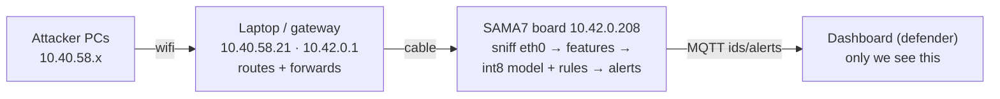

# macrodea — Edge AI Intrusion Detection

Real-time network intrusion detection running **on the edge** — a Microchip
SAMA7D65 board that watches its own traffic and flags attacks live, on-device,
with a tiny quantized neural net (+ rules as backup). Built for the Edge AI NIDS
challenge.

Detects: **port scan · flood · brute-force · slowloris · ARP spoof (MITM)**.

## How it works

The board sniffs its own `eth0`, turns traffic into a handful of features every
second (per source), and classifies each source. Alerts go out over MQTT and land
on a live dashboard that names the attacker.



## The model

A **3 KB int8-quantized MLP** (TensorFlow Lite), running on the board's
`tflite_runtime`. Six features per source over a 5s window:

`packets · distinct ports · SYNs · top-port hits · held connections · packet rate`

Each maps to one attack's signature (scan = many ports, flood = high rate,
brute-force = many hits to one port, slowloris = held connections). Trained on
traffic recorded **on the board itself**, so it fits what the board can actually
measure live. Rules run alongside as a fast fallback; ARP spoofing is a separate
watch.

## Run it

**Board** (detector, auto-starts as a service):
```
systemctl start edge-ids
```

**Defender dashboard** (on the laptop — this is *our* view):
```
python3 dashboard.py            # http://10.40.58.21:8080
```

**Attacker** (run on *another* PC — real attacks, real traffic):
```
sudo ip route add 10.42.0.0/24 via 10.40.58.21     # once, so the PC can reach the board
python3 simulate.py 10.42.0.208 scan               # or: flood | bruteforce | slowloris | normal
```
The board sees the real source IP and the dashboard names it. The attackers just
run commands; the detection dashboard is for the defender.

## The ML side

- `train.py` — trains the tiny model, exports int8 `model.tflite` (run in a TF env).
- `train.ipynb` — model notebook: epoch sweep, grid search, confusion matrix.
- `cic_benchmark.ipynb` — offline benchmark on **CIC-IDS2017** (XGBoost, GPU) → **99.88%**.
- `dataset.csv` — the traffic we recorded on the board to train on.
- record more data: `python3 simple_ids.py --record <label>` on the board.

## Files

| file | what |
|---|---|
| `simple_ids.py` | detector — runs on the board (model + rules + recorder) |
| `simulate.py` | attacker — run on another PC |
| `dashboard.py` | defender GUI (live monitor + threat feed) |
| `arp_selftest.py` | contained ARP-spoof self-test (own link only) |
| `metrics.py` / `measure.sh` | on-board resource metrics (CPU/RAM/temp) |
| `watch-traffic.sh` | stream the board's live packets into Wireshark |
| `train.py` / `*.ipynb` | training + benchmark |
| `architecture.drawio` | editable architecture diagram |
| `edge-ids.service` | systemd unit |

## Notes

- The model trains on data recorded on this board — retrain when you record more.
- CIC-IDS2017 uses 78 flow features the board can't compute live, so it's an
  **offline benchmark** only; the live model uses the 6 features above.
- Board login is `root` / `root` (hackathon).
