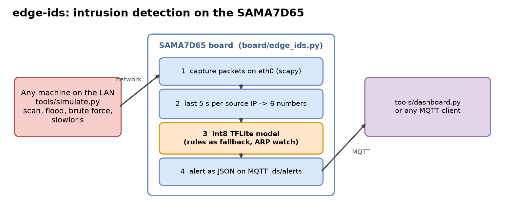
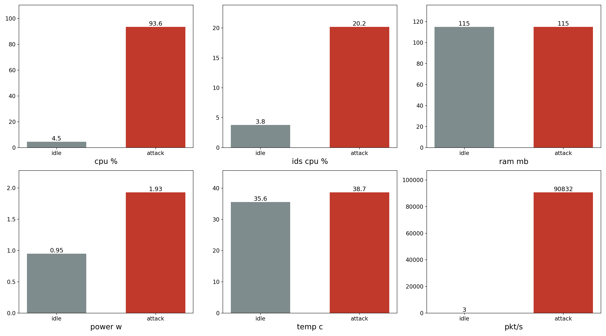
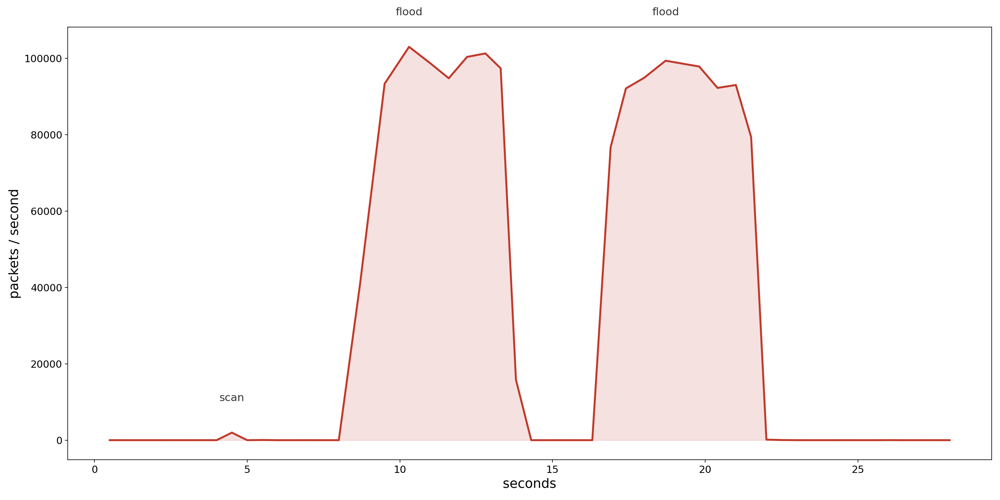

# macrodea

Network intrusion detection that runs on the edge device itself. A Microchip
SAMA7D65 board watches its own network traffic, recognises attacks with a tiny
int8 neural network and reports them over MQTT within about a second. No cloud,
and no PC needed for the detection.

It picks up:

| attack | what gives it away |
|---|---|
| port scan | one source touching lots of different ports |
| flood | the packet rate at the network card shoots up |
| brute force | many new connections to one port (ssh, mqtt, ...) |
| slowloris | lots of connections that get opened and then just held |
| ARP spoofing (MITM) | an IP address suddenly answering from a different MAC |



## Quick start

**On the board** you need Python 3 with `scapy` and `numpy`, `tflite_runtime`
for the model (we use 2.14) and a mosquitto broker with the `mosquitto_pub`
client. Our SAMA7D65 image already had all of that. If yours doesn't,
`pip3 install scapy numpy tflite-runtime` works as long as there's a
tflite-runtime wheel for your Python version. Without `tflite_runtime` the
detector still runs, just on the fallback rules.

**From your PC**, in this repo:

```sh
./deploy.sh 192.168.1.50        # your board's IP
```

That copies `board/` to `/root/ids` on the board, installs the `edge-ids`
systemd service and starts it. Check that it's up:

```sh
ssh root@192.168.1.50 journalctl -u edge-ids -f
```

You should see `edge-ids on eth0 [...] | model: on`. Importing scapy takes
around ten seconds on the board, so give it a moment.

If the board isn't on plain `eth0` with private addresses, set these in
`board/edge-ids.service` before you deploy (no spaces in the values):

| variable | default | what it does |
|---|---|---|
| `IDS_IFACE` | `eth0` | interface to watch |
| `IDS_LAN` | all private ranges | source prefixes to analyse, comma separated, e.g. `192.168.1.` |
| `IDS_NAMES` | none | names for the alerts, e.g. `192.168.1.10=plc,192.168.1.20=hmi` |

To change them on a board that's already running, use a drop-in file.
`deploy.sh` replaces the service file every time, but it never touches this:

```sh
mkdir -p /etc/systemd/system/edge-ids.service.d
printf '[Service]\nEnvironment=IDS_IFACE=eth1\n' > /etc/systemd/system/edge-ids.service.d/local.conf
systemctl daemon-reload && systemctl restart edge-ids
```

The rule thresholds are at the top of `board/edge_ids.py`.

## Seeing it work

Watch the alerts raw on the board:

```sh
ssh root@192.168.1.50 mosquitto_sub -t ids/alerts
```

or in the browser. The dashboard runs on your PC and follows the board over
ssh, so put your key on the board first (`ssh-copy-id root@192.168.1.50`):

```sh
python3 tools/dashboard.py 192.168.1.50      # then open http://localhost:8080
```

It only says SECURE while the detector's heartbeat keeps arriving (it sends
one on `ids/status` every 5 seconds). A stopped or crashing detector shows up
as DETECTOR DOWN instead of looking like a quiet network.

Then attack the board from another machine on the network. `tools/simulate.py`
only uses plain sockets, so it runs anywhere Python runs and needs no root.
Only point it at a board you own.

```sh
python3 tools/simulate.py 192.168.1.50 scan        # or: flood, bruteforce, slowloris, normal
```

The ARP-spoof detector has its own test. It fakes a MAC change for an IP
nobody uses, so no real host gets spoofed:

```sh
sudo python3 tools/arp_selftest.py eth0 192.168.1.50 192.168.1.250
```

An alert looks like this:

```json
{"time": "14:02:11", "type": "scan", "src": "192.168.1.66", "who": "unknown", "detector": "model", "detail": "model 99% (ports=100 held=1)"}
```

Easiest is to have the board and the attacking machine on the same network. If
the board is cabled straight to your PC, run the attacks from that PC. Traffic
from a third machine would have to be routed and forwarded through your PC, and
a shared connection (NetworkManager's "shared to other computers", for
example) blocks that by default.

## How it works

`board/edge_ids.py` sniffs `eth0` with scapy. For every source IP it keeps the
last 5 seconds of traffic and boils that down to six numbers:

| feature | meaning |
|---|---|
| `pkts` | packets from this source |
| `ports` | distinct destination ports |
| `syns` | new TCP connections (SYN without ACK) |
| `top_port` | new connections to the single busiest port |
| `held` | most connections held open on any one port (ssh on 22 doesn't count) |
| `nic_pps` | packets per second at the network card, all sources together |

Once a second these go through the model (`board/model.tflite`). It answers
normal, scan, flood, bruteforce or slowloris with a confidence, and anything
that isn't normal at 75% or more becomes an alert. When the model can't be
loaded, fixed thresholds do the same job. ARP spoofing is caught separately
by remembering which MAC each IP uses.

A few details that matter on a small single-core board:

- During a flood scapy only gets to see a fraction of the packets, so the
  packet rate comes from the kernel's own counter
  (`/sys/class/net/eth0/statistics/rx_packets`) instead of counting in Python.
- Sources that are barely talking aren't sent to the model. Trickle traffic
  was where the false alarms came from.
- Only private (LAN) source addresses are analysed, so replies from the
  internet don't set anything off.

## The model

A small neural network: 6 inputs, one hidden layer of 24 ReLU units and 5
outputs, 293 weights in total. Each feature goes through `log1p` and is
divided by its maximum from the training data, so everything lands in 0..1
(the packet rate goes up to about 100k, the other counts stay under 200).

It's trained on `data/dataset.csv`, 167 five-second windows we recorded on the
board itself while running real attacks against it. So it learned from exactly
the numbers the board can measure live.

| class | windows |
|---|---|
| slowloris | 54 |
| normal | 52 |
| flood | 24 |
| scan | 19 |
| bruteforce | 18 |

With 30% of the windows held out as a test set, the network gets 96.1%, and
exactly the same after int8 quantization. The model in `board/` was trained
on all 167 windows and gets 162 of them right (97.0%). `notebooks/train.ipynb`
walks through all of it: class averages, accuracy per epoch, how big the hidden
layer needs to be, the confusion matrix and the quantization step by step.

### int8 quantization, in plain words

Training happens on a PC in normal 32-bit floats. The board gets an int8
version: every weight and every value flowing through the network is stored as
a whole number between -128 and 127.

Think of it as giving every tensor its own ruler. The ruler has a step size
(`scale`) and a mark for zero (`zero_point`), and a stored integer means

```
real value = scale * (int8 value - zero_point)
```

For our model's input the converter picked `scale = 1/255` and
`zero_point = -128`. The inputs are already scaled to 0..1, so 0.0 is stored
as -128, 0.5 as 0 and 1.0 as 127. The output is a probability with
`scale = 1/256`, so an output of 127 means (127 + 128) / 256 = 99.6%.

To pick those rulers the converter needs to see real data. We hand it our
training windows (the "representative dataset") and it records the range each
layer actually uses. That's all these lines in `training/train.py` do:

```python
converter = tf.lite.TFLiteConverter.from_keras_model(model)
converter.optimizations = [tf.lite.Optimize.DEFAULT]                        # turn quantization on
converter.representative_dataset = representative_data                      # real data to measure ranges on
converter.target_spec.supported_ops = [tf.lite.OpsSet.TFLITE_BUILTINS_INT8]  # int8 ops only, fail if impossible
converter.inference_input_type = tf.int8                                    # the board feeds int8 in
converter.inference_output_type = tf.int8                                   # and gets int8 back
tflite = converter.convert()
```

On the board, `model_predict()` in `edge_ids.py` does the same thing by hand:

1. `log1p` the six numbers and divide by `scale` from `model.json`, giving values in 0..1
2. `q = round(x * 255 - 128)`, six int8 values for the model
3. run the model, get five int8 outputs back
4. `p = (out + 128) / 256` turns those into probabilities, the biggest one wins

A typical scan window as an example (the median of the recorded ones): 89
packets, 50 ports, 71 SYNs, top port 2, held 2, 10 packets/s. After step 1 that's `0.86 0.99 0.89 0.27 0.34 0.21`,
after step 2 `92 125 98 -60 -42 -75`, and the model answers 127 (99.6%) for
scan and -127 or -128 (about 0%) for everything else.

Why bother? Each weight takes one byte instead of four, and integer math is
what the board's Cortex-A7 is good at. On the test set the int8 model gives the
same answer as the float one on all 51 windows. The file itself stays around
3 KB either way, since at this size it's mostly TFLite bookkeeping, but the
weights shrink from 1,172 bytes to 380.

### Training it on your own traffic

The model only knows the traffic it has seen, so on a new network it's worth
recording some of your own. On the board, stop the service and record one
class at a time while you generate that traffic:

```sh
systemctl stop edge-ids
cd /root/ids
python3 edge_ids.py --record normal     # use the network normally for a few minutes, Ctrl-C
python3 edge_ids.py --record scan       # while simulate.py scans from another machine, Ctrl-C
```

Every window of every active source gets appended to `/root/ids/dataset.csv`
with that label, so keep other traffic down while recording an attack. Then
copy the file back, add the rows to `data/dataset.csv`, and on your PC:

```sh
python3.12 -m venv .venv && . .venv/bin/activate
pip install -r requirements.txt
python training/train.py                # writes board/model.tflite and board/model.json
./deploy.sh 192.168.1.50
```

## Results on the board

Measured with `tools/measure.sh` on the SAMA7D65 (one Cortex-A7 core), idle
and during a UDP flood of about 90k packets/s:

| | idle | during the flood |
|---|---|---|
| CPU, whole core | 4.5% | 93.6% |
| CPU used by edge-ids | 3.8% | 20.2% |
| RAM used, whole board | 115 MB | 115 MB |
| power (estimated) | 0.95 W | 1.93 W |
| temperature | 35.6 C | 38.7 C |

During the flood most of the CPU goes to the kernel handling packets, edge-ids
itself stays around 20% and memory doesn't move. The board has no power sensor,
so power is estimated from CPU load (see `board/metrics.py`).



Packet rate seen by the board during a scan followed by two floods:



For comparison with published work, `notebooks/cic_benchmark.ipynb` trains
three models on a 40,000-flow slice of CIC-IDS2017 mapped to the same five
classes: XGBoost 99.88%, random forest 99.77%, MLP 99.39%. Those models use 78 flow
features that can't be computed live on the board, so treat it as a check that
the five classes are learnable, not as what runs on the device.

## What's where

```
board/               everything that runs on the board (deploy.sh copies it over)
  edge_ids.py          the detector
  model.tflite         the int8 model, 3 KB
  model.json           feature order, labels and input scaling for the model
  edge-ids.service     systemd unit
  metrics.py           CPU / RAM / temperature snapshot
  sample_traffic.py    packet rate over time, for the traffic chart
tools/               runs on your PC
  dashboard.py         live alerts in the browser
  simulate.py          test attacks
  arp_selftest.py      safe trigger for the ARP-spoof detector
  measure.sh           idle vs. flood resource numbers
  watch-traffic.sh     the board's traffic live in Wireshark
  plot_results.py      charts from the measurements
training/train.py    dataset -> int8 model.tflite + model.json
notebooks/           train.ipynb (the model step by step), cic_benchmark.ipynb
data/                dataset.csv (recorded on the board), cic_slice.csv.gz (CIC-IDS2017 slice)
docs/                architecture diagram (+ draw.io source) and result charts
tests/               pytest suite, runs on a PC
deploy.sh            copy board/ to a board and start the service
```

## Development

```sh
python3.12 -m venv .venv && . .venv/bin/activate
pip install -r requirements.txt
pytest                  # no board or root needed
jupyter lab notebooks/
```

The tests build packets with scapy and feed them straight into the detector,
so they run on any Linux machine.
